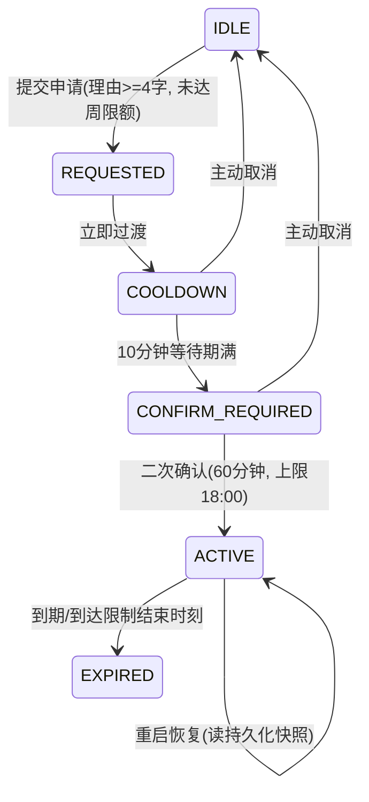

# LOL LOCK

一个给自己做的行为约束系统：在设定时段内锁定《英雄联盟》，把"管住自己"从意志力问题变成一个工程问题。

核心思路不是"禁止"，而是**摩擦设计**——想玩可以，但必须穿越一整套刻意变得麻烦的流程，让冲动在流程中自然衰减。

## 它是怎么工作的

限制时段内，后台监控线程每 30 秒轮询一次目标进程（`LeagueClient.exe` / `League of Legends.exe`），发现即关闭，并弹出警告窗口。开机自启动，历史记录持久化到本地。

想临时解锁？流程是这样的：

1. **写理由**——解锁申请必须附带至少 4 个字的理由，写不出来就不许提
2. **等冷却**——提交后强制等待 10 分钟（冲动最怕的就是延迟）
3. **二次确认**——等待期满后还要再确认一次才会生效
4. **限时使用**——解锁窗口 60 分钟，且最迟到当日限制结束时刻（18:00）失效
5. **周限额**——每周最多 3 次，用完即止

## 解锁状态机

临时解锁由一个六状态状态机管理，时间迁移采用惰性判断（调用时依据截止时刻推进，不依赖定时器），生效中的解锁会持久化快照，**程序重启后自动恢复**：



## 架构

```
lol_lock/
├── main.py              # 入口与依赖组装
├── config.py            # 全部行为参数集中配置（时段/进程/解锁规则）
├── core/
│   ├── monitor.py       # QThread 监控线程：轮询 + 关闭目标进程
│   ├── scheduler.py     # 限制时段判定
│   ├── enforcer.py      # 进程关闭执行（区分客户端与受保护的游戏进程）
│   ├── unlock.py        # 六状态解锁状态机
│   └── autostart.py     # Windows 注册表开机自启
├── ui/                  # PyQt5 界面（主窗口/解锁对话框/警告弹窗）
├── storage/history.py   # 拦截与解锁历史（JSON 持久化, %LOCALAPPDATA%）
└── tests/               # 6 个测试模块，pytest
```

## 一些设计决策

- **受保护进程**：游戏主进程被标记为受保护对象，处理逻辑与客户端进程区分对待，避免在游戏运行中途粗暴终止导致的问题
- **参数集中**：所有行为参数（时段、轮询间隔、解锁规则）收敛在 `config.py` 单文件，改行为不用翻代码
- **TEST_MODE**：调试开关，开启后只记录和提示、不真正结束进程——正式使用必须为 `False`
- **重启恢复**：解锁状态写入磁盘快照，程序重启后未过期的解锁继续生效，重启不构成绕过手段

## 规模与测试

约 1500 行 Python（21 个文件），其中单元测试约 600 行（**约 40% 的代码量是测试**），覆盖状态机全迁移、时段判定、历史记录、自启动等模块。

```bash
pip install -r requirements.txt
pytest                    # 运行测试
python main.py            # 启动（Windows + PyQt5）
```

## 声明

仅供个人自我约束使用。它防的是"顺手点开"的冲动，不是防一个决心绕过它的工程师——真要绕，杀进程就行了。工具的意义在于把"再玩一把"的成本从 0 变成正数。
